# QML

## 前言

主要学习思路参考网站[qmlbook](https://qmldoc.cn/print.html)，以QT5官方文档为辅，查颜色看[这个](https://www.w3.org/TR/css-color-3/#svg-color)。

___
## 目录
- [QML](#qml)
  - [前言](#前言)
  - [目录](#目录)
  - [入门](#入门)
    - [基本元素](#基本元素)
      - [**基础元素对象（Item Element）**](#基础元素对象item-element)
      - [**矩形框元素（Rectangle Element）**](#矩形框元素rectangle-element)
      - [**文本元素（Text Element）**](#文本元素text-element)
      - [**图像元素（Image Element）**](#图像元素image-element)
      - [**鼠标区域元素（MouseArea Element）**](#鼠标区域元素mousearea-element)
    - [组件](#组件)
    - [简单转换](#简单转换)
    - [定位元素](#定位元素)
      - [**Row（行）**](#row行)
      - [**Column（列）**](#column列)
      - [**Grid（组、格栅）**](#grid组格栅)
      - [**Flow（流）**](#flow流)
      - [**Repeater（重复元素）**](#repeater重复元素)
    - [布局元素](#布局元素)
    - [输入元素](#输入元素)
      - [**文本输入（TextInput）**](#文本输入textinput)
      - [**焦点区域（FocusScope）**](#焦点区域focusscope)
      - [**文本编辑（TextEdit）**](#文本编辑textedit)
      - [**按键元素（Key Element）**](#按键元素key-element)
  - [动态元素](#动态元素)
    - [动画](#动画)
      - [**动画元素（Animation Elements）**](#动画元素animation-elements)
      - [**应用动画（Applying Animations）**](#应用动画applying-animations)
        - [`Animation on`属性动画](#animation-on属性动画)
        - [`behavior on`属性动作](#behavior-on属性动作)
        - [`standalone animation`独立运行动画](#standalone-animation独立运行动画)
      - [**缓冲曲线（Easing Curves）**](#缓冲曲线easing-curves)
      - [**动画分组（Grouped Animations）**](#动画分组grouped-animations)
        - [`ParallelAnimation`（平行动画）](#parallelanimation平行动画)
        - [`SequentialAnimation`（连续动画）](#sequentialanimation连续动画)
      - [嵌套动画分组](#嵌套动画分组)
    - [状态与过渡](#状态与过渡)
      - [**状态（States）**](#状态states)
      - [过渡（Transitions）](#过渡transitions)
  - [模型-视图-代理](#模型-视图-代理)
  - [画布](#画布)
  - [例子模拟](#例子模拟)
  - [着色器效果](#着色器效果)
  - [网络](#网络)
  - [存储](#存储)
  - [动态QML](#动态qml)
  - [JS](#js)
  - [Qt and C++](#qt-and-c)
- [因不需要研究这么细致，所以从《模型-视图-代理》这章开始不再记录每章每节内容知识点和demo，而是采取一章一demo做总结](#因不需要研究这么细致所以从模型-视图-代理这章开始不再记录每章每节内容知识点和demo而是采取一章一demo做总结)

___
## 入门

### 基本元素

#### **基础元素对象（Item Element）**

Item（基础元素对象）是所有可视化元素的基础对象，所有其它的可视化元素都继承自Item。它自身不会有任何绘制操作，但是定义了所有可视化元素共有的属性：

| Group（分组） |	Properties（属性） |
| :-: | :-: |
| **Geometry**（几何属性） |	`x`,`y`（坐标）定义了元素左上角的位置，`width`，`height`（长和宽）定义元素的显示范围，`z`（堆叠次序）定义元素之间的重叠顺序。 |
| **Layout handling**（布局操作） |	`anchors`（锚定），包括左（`left`），右（`right`），上（`top`），下（`bottom`），水平与垂直居中（`vertical center`，`horizontal center`），与`margins`（间距）一起定义了元素与其它元素之间的位置关系。 |
| **Key handlikng**（按键操作） |	附加属性`key`（按键）和`keyNavigation`（按键定位）属性来控制按键操作，处理输入焦点（`focus`）可用操作。 |
| **Transformation**（转换） |	缩放（`scale`）和`rotate`（旋转）转换，通用的`x`,`y`,`z`属性列表转换（`transform`），旋转基点设置（`transformOrigin`）。 |
| **Visual**（可视化） |	不透明度（`opacity`）控制透明度，`visible`（是否可见）控制元素是否显示，`clip`（裁剪）用来限制元素边界的绘制，`smooth`（平滑）用来提高渲染质量。 |
| **State definition**（状态定义） |	`states`（状态列表属性）提供了元素当前所支持的状态列表，当前属性的改变也可以使用`transitions`（转变）属性列表来定义状态转变动画。 |

#### **矩形框元素（Rectangle Element）**

```QML
    Rectangle {
        id: rect1

        //坐标
        x: 12
        y: 12

        //尺寸
        width: 70
        height: 100

        //矩形颜色
        color: "lightsteelblue"
    }

    Rectangle {
        id: rect2

        x: 100; y: 12
        width: 70; height: 100

        border.color: "green" //矩形边框颜色
        border.width: 5 //矩形边框宽度
        radius : 10 //圆角，半径
    }
```
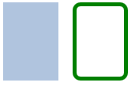

> **注意：**：颜色的命名是来自SVG颜色的名称（查看(http://www.w3.org/TR/css3-color/#svg-color)可以获取更多的颜色名称）。你也可以使用其它的方法来指定颜色，比如RGB字符串（'#FF4444'），或者一个颜色名字（例如'white'）。

#### **文本元素（Text Element）**

```QML
    Text {
        text: "Hello World! Click Me To Quit!"
    }
```
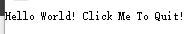

#### **图像元素（Image Element）**

```QML
    Image {
        anchors.centerIn: parent
        source: "猫.jpg"
    }
```
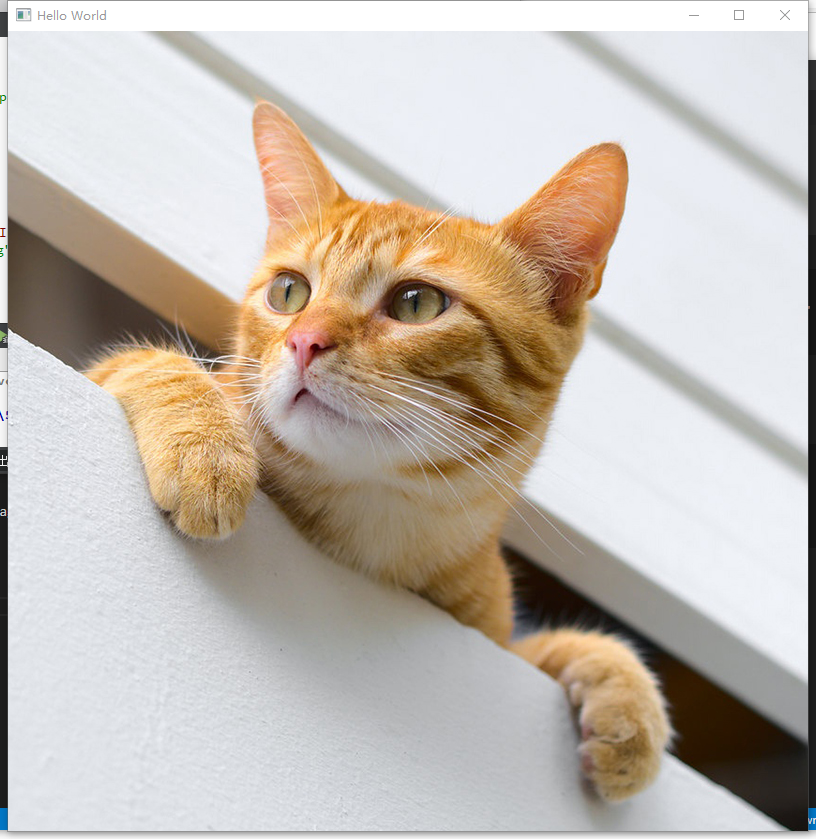

#### **鼠标区域元素（MouseArea Element）**

```QML
    Rectangle {
        id: rect1

        x: 12; y: 12

        width: 70; height: 100

        color: "lightsteelblue"
    }

    Rectangle {
        id: rect2

        x: 100; y: 12
        width: 70; height: 100

        border.color: "green"
        border.width: 5
        radius : 10

        MouseArea {
            id: mouse_area
            width: parent.width
            height: parent.width
            onClicked: rect1.visible = !rect1.visible
        }
    }
```
  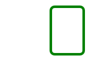

### 组件

一个组件是一个可以重复使用的元素，QML提供几种不同的方法来创建组件。但是目前我们只对其中一种方法进行讲解：一个文件就是一个基础组件。一个以文件为基础的组件在文件中创建了一个QML元素，并且将文件以元素类型来命名（例如后面给出的Button.qml）。

设计一个按钮，由一个矩阵内添加一个文本块和一个鼠标事件块组成。
```QML
//Button.qml
import QtQuick 2.0

Rectangle {
    id: root

    //导出属性
    property alias text: label.text
    signal clicked

    width: 116; height: 26
    color: "lightsteelblue"
    border.color: "slategrey"

    Text {
        id: label
        anchors.centerIn: parent
        text: "Start" //因为text被导出，所以可以不在这里初始化内容
    }

    MouseArea {
        anchors.fill: parent
        onClicked: {
            root.clicked()
        }
    }
}

```

如此组件就写好了，只要我们将包含组件的文件保存到项目目录中，就可以任意使用它了。

```QML
    Button {
        id: button
        x:50; y:50
        text: "开始"
        onClicked: {
            status.text = "开始就开始！"
        }
    }

    Text {
        id: status
        x:50; y:200
        width: 150; height: 50
        text: "等待中···"
        horizontalAlignment: Text.AlignHCenter
    }
```
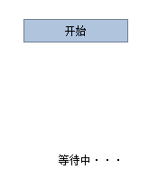  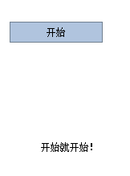

> **提示**：若想增加组件的密封性，可以让组件嵌套到Item对象里（记得导出属性），这样可以防止用户更改组件属性，以Button.qml为例：
```QML
//Button.qml
import QtQuick 2.0

Item {
    id: root

    property alias text: button.text
    signal clicked

    Rectangle {
        id: button

        //导出属性
        property alias text: label.text
        signal clicked

        width: 116; height: 26
        color: "lightsteelblue"
        border.color: "slategrey"

        Text {
            id: label
            anchors.centerIn: parent
        }

        MouseArea {
            anchors.fill: parent
            onClicked: {
                root.clicked()
            }
        }
    }
}
```

### 简单转换

转换操作改变了一个对象的几何状态。QML元素对象通常能够被平移，旋转，缩放。

简单的位移是通过改变`x`,`y`坐标来完成的。旋转是改变`rotation`（旋转）属性来完成的，这个值使用角度作为单位（0~360）。缩放是通过改变`scale`（比例）的属性来完成的，小于1意味着缩小，大于1意味着放大。旋转与缩放不会改变对象的几何形状，对象的`x`,`y`（坐标）与`width`/`height`（宽/高）也类似。只有绘制指令是被转换的对象。

利用之前所写过的按钮组件，实现点击按钮让图形进行相应的转换。
```QML
    Image {
        id: photo
        width: 300; height: 300
        source: "骷髅.png"
    }

    Button {
        id: button1
        x: 350; y: 0
        text: "按钮平移"
        onClicked: {
            photo.y += 100 //向下平移100个像素点
        }
    }

    Button {
        id: button2
        x: 450; y: 0
        text: "按钮旋转"
        onClicked: {
            photo.rotation += 90.0 //顺时针旋转90°
        }
    }

    Button {
        id: button3
        x:550; y: 0
        text: "按钮缩放"
        onClicked: {
            photo.scale += 0.5 //放大0.5倍
        }
    }
```
点击按钮前：  
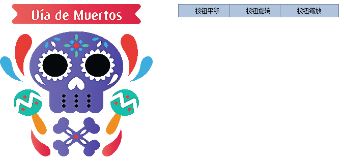
点击平移按钮：    
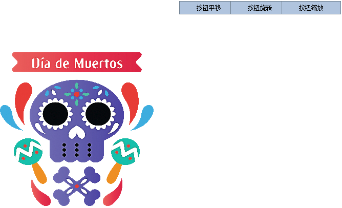  
点击旋转按钮：  
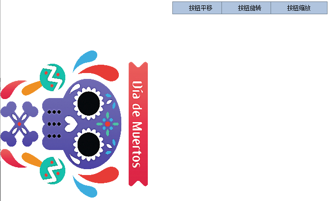  
点击缩放按钮：  
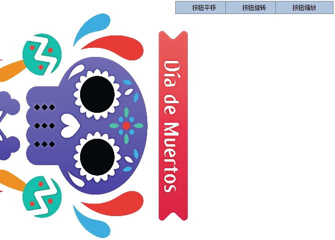

### 定位元素

有一些QML元素被用于放置元素对象，它们被称作定位器，QtQuick模块提供了`Row`（行），`Column`（列），`Grid`（组、格栅），`Flow`（流）用来作为定位器。

在展示例子前需要定义一些方块（这里只取其中一种，所有方块只有颜色是不同的）用于之后的展示：
```QML
Rectangle {
    width: 50
    height: 50

    color: "blue"
    border.color: Qt.lighter(color)
}
```
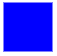

#### **Row（行）**

`Row`（行）元素将它的子对象通过顶部对齐的方式从左到右，或者从右到左依次排列。
```QML
    Row {
        id: row
        anchors.centerIn: parent
        layoutDirection: Qt.RightToLeft //排列方式，从右到左排列,默认从左到右
        spacing: 20 //元素间隔

        RectangleBlue { }
        RectangleGreen { }
        RectangleRed { }
    }
```
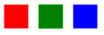

#### **Column（列）**

`Column`（列）元素将它的子对象通过顶部对齐的列方式进行排列。
```QML
    Column {
        id: column
        anchors.centerIn: parent
        spacing: 5 //元素间隔

        RectangleBlue { }
        RectangleGreen { }
        RectangleRed { }
    }
```
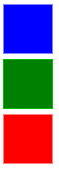

#### **Grid（组、格栅）**

通过设置`rows`（行数）和`columns`（列数）将子对象排列在一个栅格中。属性`flow`（流）与`layoutDirection`（布局方向）用来控制子元素的加入顺序。
```QML
    Grid {
        id: grid
        anchors.centerIn: parent
        spacing: 5 //元素间隔
        columns: 2
        //rows: 3 //行与列只设置一个，格栅会自动计算另一个

        RectangleBlue { }
        RectangleGreen { }
        RectangleRed { }
        RectangleBlue { }
        RectangleGreen { }
        RectangleRed { }
    }
```
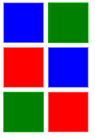

#### **Flow（流）**

通过`flow`（流）属性和`layoutDirection`（布局方向）属性来控制流的方向。它能够从头到底的横向布局，也可以从左到右或者从右到左进行布局。作为加入流中的子对象，它们在需要时可以被包装成新的行或者列。为了让一个流可以工作，必须指定一个宽度或者高度，可以通过属性直接设定，或者通过`anchor`（锚定）布局设置。

```QML
Window {
    id: root
    visible: true
    width: 300
    height: 300
    title: qsTr("Hello World")

    Flow {
        id: flow
        anchors.centerIn: parent
        spacing: 5 //元素间隔
        anchors.fill: parent
        anchors.margins: 20 //元素与边框间隔
        flow: Flow.TopToBottom //从上到下排列

        RectangleBlue { }
        RectangleGreen { }
        RectangleRed { }
        RectangleBlue { }
        RectangleGreen { }
        RectangleRed { }
    }
}
```
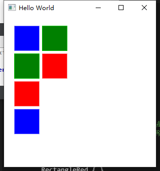

#### **Repeater（重复元素）**

通常Repeater（重复元素）与定位器一起使用。它的工作方式就像for循环与迭代器的模式一样。
```QML
    Grid {
        id: grid
        anchors.centerIn: parent
        spacing: 5 //元素间隔
        anchors.fill: parent

        Repeater {
            anchors.fill: parent
            model: 13 //连续显示13个元素
            RectangleBlue { }
        }
    }
```
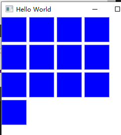

### 布局元素

QML使用`anchors`（锚）对元素进行布局。`anchoring`（锚定）是基础元素对象的基本属性，可以被所有的可视化QML元素使用。一个`anchors`（锚）就像一个协议，并且比几何变化更加强大。`Anchors`（锚）是相对关系的表达式，通常需要与其它元素搭配使用。  

一个元素有6条锚定线（`top`顶，`bottom`底，`left`左，`right`右，`horizontalCenter`水平中，`verticalCenter`垂直中）。在文本元素（`Text` Element）中有一条文本的锚定基线（`baseline`）。每一条锚定线都有一个偏移（`offset`）值，在`top`（顶），`bottom`（底），`left`（左），`right`（右）的锚定线中它们也被称作边距。对于`horizontalCenter`（水平中）与`verticalCenter`（垂直中）与`baseline`（文本基线）中被称作偏移值。
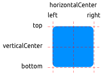

```QML
    Grid {
        id: flow
        anchors.centerIn: parent
        columns: 3
        spacing: 5 //元素间隔
        anchors.fill: parent

        RectangleBlue {
            RectangleGreen {
                //width: 30
                anchors.fill: parent //填充
                anchors.margins: 10 //边缘间隔
                Text {
                    anchors.centerIn: parent
                    text: "(1)"
                }
            }
        }

        RectangleBlue {
            RectangleGreen {
                width: 40
                height: 30
                anchors.left: parent.left //子矩形的左边与父矩形的左边对其
                anchors.leftMargin: 10 //左边框间隔
                Text {
                    anchors.centerIn: parent
                    text: "(2)"
                }
            }
        }

        RectangleBlue {
            RectangleGreen {
                anchors.left: parent.right //子矩阵左边框与父矩阵右边框对齐
                Text {
                    anchors.centerIn: parent
                    text: "(3)"
                }
            }
        }

        RectangleBlue {
            RectangleGreen {
                id: green1
                width: 30
                height: 10
                //与父矩形 中间对齐
                anchors.horizontalCenter: parent.horizontalCenter
            }

            RectangleGreen {
                id: green2
                width: 40
                height: 20
                //顶部与green1底部对齐，中间对齐
                anchors.top: green1.bottom
                anchors.topMargin: 5
                anchors.horizontalCenter: green1.horizontalCenter
                Text {
                    anchors.centerIn: parent
                    text: "(4)"
                }
            }
        }

        RectangleBlue {
            RectangleGreen {
                width: 30
                height: 30
                anchors.centerIn: parent //居中，需要自己设置元素大小
                Text {
                    anchors.centerIn: parent
                    text: "(5)"
                }
            }
        }

        RectangleBlue {
            RectangleGreen {
                width: 30
                height: 30

                anchors.horizontalCenter: parent.horizontalCenter
                anchors.verticalCenter: parent.verticalCenter
                anchors.verticalCenterOffset: 15 //垂直偏移量+15
                Text {
                    anchors.centerIn: parent
                    text: "(6)"
                }
            }
        }
    }
```
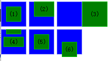

### 输入元素

#### **文本输入（TextInput）**

这个元素支持使用正则表达式验证器来限制输入和输入掩码的模式设置。
```QML
    Rectangle {
        width: 200
        height: 80
        color: "linen"

        TextInput {
            id: input1
            x: 8; y: 8
            width: 96; height: 20
            focus: true //初始焦点
            text: "Text Input 1"
            KeyNavigation.tab: input2 //切换焦点，就是切换输入位置
        }

        TextInput {
            id: input2
            x: 8; y: 36
            width: 96; height: 20
            text: "Text Input 2"
            KeyNavigation.tab: input1
        }
    }
```
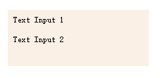

#### **焦点区域（FocusScope）**

有时候需要使用其他元素对TextInput进行包装，当需要切换焦点时，因为包装元素无法将接受到的焦点转发给TextInput，所以就需要使用到**焦点区域**`FocusScope`。

```QML
//UnitTextInput.qml
import QtQuick 2.0

FocusScope {
    width: 100
    height: 20

    Rectangle {
        anchors.fill: parent
        color: "honeydew"
        border.color: "black"
    }

    TextInput {
        id: input
        anchors.fill: parent
        anchors.margins: 5
        focus: true
    }
}
```
```QML
    Rectangle {
        width:300
        height:300
        anchors.centerIn: parent
        color: "linen"

        Column {
            anchors.fill: parent
            anchors.centerIn: parent


            UnitTextInput {
                id: input1
                KeyNavigation.tab: input2
            }

            UnitTextInput {
                id: input2
                KeyNavigation.tab: input1
            }
        }
    }
```
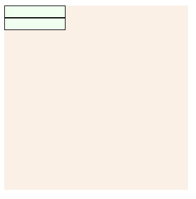

#### **文本编辑（TextEdit）**

文本编辑（`TextEdit`）元素与文本输入（`TextInput`）非常类似，它支持多行文本编辑。它不再支持文本输入的限制，但是提供了已绘制文本的大小查询（`paintedHeight`，`paintedWidth`）。

```QML
//UnitTextEdit.qml
import QtQuick 2.0

FocusScope {
    width: 100; height: 100
    Rectangle {
        anchors.fill: parent
        color: "lightsteelblue"
        border.color: "gray"
    }

    property alias text: input.text
    property alias input: input

    TextEdit {
        id: input
        anchors.fill: parent
        anchors.margins: 4
        focus: true
    }
}
```
```QML
    Rectangle {
        width:300
        height:300
        anchors.centerIn: parent
        color: "linen"

        UnitTextEdit {
            id: input1
            focus: true
            text: "MyTextEdit"
        }
    }
```
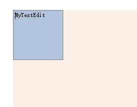

#### **按键元素（Key Element）**

附加属性`key`允许你基于某个按键的点击来执行代码。例如使用`up`，`down`按键来移动一个方块，`left`，`right`按键来旋转一个元素，`plus`，`minus`按键来缩放一个元素。

```QML
    Rectangle {
        anchors.fill: parent
        color: "linen"

        RectangleGreen {

            id: hero
        }

        focus: true

        //上下左右
        Keys.onLeftPressed: hero.x -= 10
        Keys.onRightPressed: hero.x += 10
        Keys.onUpPressed: hero.y -= 10
        Keys.onDownPressed: hero.y += 10
        Keys.onPressed: { //缩放
            switch(event.key) {
            case Qt.Key_Plus:
                hero.scale += 0.2
                break;
            case Qt.Key_Minus:
                hero.scale -= 0.2
                break;
            }
        }
    }
```
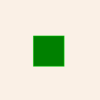

___
## 动态元素

### 动画

**动画控制了属性的改变**。一个动画定义了属性值改变的曲线，将一个属性值变化从一个值过渡到另一个值。动画是由一连串的目标属性活动定义的，平缓的曲线算法能够引发一个定义时间内属性的持续变化。所有在QtQuick中的动画都由同一个计时器来控制，因此它们始终都保持同步，这也提高了动画的性能和显示效果。

这里有一个demo，显示一个骷髅头的平移+旋转+缩小+变透明的动画效果组件：
```QML
//MySkeletonAnimations.qml
import QtQuick 2.0

Image {
    x: 50; y: 80
    width: 200
    height: 200
    source: "骷髅.png"

    //平移动画
    NumberAnimation on x {
        to: 500
        duration: 4000
        loops: Animation.Infinite
    }

    //旋转动画
    RotationAnimation on rotation {
        to: 360
        duration: 4000
        loops: Animation.Infinite
    }

    //透明动画
    PropertyAnimation on opacity {
        to: 0.1
        duration: 4000
        loops: Animation.Infinite
    }

    //缩小
    PropertyAnimation on scale {
        to: 0.1
        duration: 4000
        loops: Animation.Infinite
    }
}
```

#### **动画元素（Animation Elements）**

有几种类型的动画，每一种都在特定情况下都有最佳的效果，下面列出了一些常用的动画：

* `PropertyAnimation`（属性动画）- 使用属性值改变播放的动画
* `NumberAnimation`（数字动画）- 使用数字改变播放的动画
* `ColorAnimation`（颜色动画）- 使用颜色改变播放的动画
* `RotationAnimation`（旋转动画）- 使用旋转改变播放的动画

除了上面这些基本和通常使用的动画元素，QtQuick还提供了一切特殊场景下使用的动画：

* `PauseAnimation`（停止动画）- 运行暂停一个动画
* `SequentialAnimation`（顺序动画）- 允许动画有序播放
* `ParallelAnimation`（并行动画）- 允许动画同时播放
* `AnchorAnimation`（锚定动画）- 使用锚定改变播放的动画
* `ParentAnimation`（父元素动画）- 使用父对象改变播放的动画
* `SmotthedAnimation`（平滑动画）- 跟踪一个平滑值播放的动画
* `SpringAnimation`（弹簧动画）- 跟踪一个弹簧变换的值播放的动画
* `PathAnimation`（路径动画）- 跟踪一个元素对象的路径的动画
* `Vector3dAnimation`（3D容器动画）- 使用`QVector3d`值改变播放的动画

当使用更加复杂的动画时，可能需要在播放一个动画时中改变一个属性或者运行一个脚本。对于这个问题，QtQuick提供了一个动作元素：

* `PropertyAction`（属性动作）- 在播放动画时改变属性
* `ScriptAction`（脚本动作）- 在播放动画时运行脚本

#### **应用动画（Applying Animations）**

动画可以通过以下方式来应用：
* `Animation on`属性动画：在元素完整加载后自动运行
* `behavior on`属性动作：当属性值改变时自动运行
* `standalone animation`独立运行动画：使用start()函数明确指定运行或者running属性被设置为true（比如通过属性绑定）

在写demo前先设计一个可点击图像组件：
```QML
//ClickableImage.qml
import QtQuick 2.0

Item {
    id: root
    width: column.childrenRect.width
    height: column.childrenRect.height
    property alias text: label.text
    property alias source: image.source
    signal clicked

    Column {
        id: column
        Image {
            width: 150
            height: 150
            id: image
        }
        Text {
            id: label
            width: image.width
            horizontalAlignment: Text.AlignHCenter
            wrapMode: Text.WordWrap
            color: "#111111"
        }
    }

    MouseArea {
        anchors.fill: parent
        onClicked: root.clicked()
    }
}
```

##### `Animation on`属性动画

这个之前也有用过，动画效果就是骷髅头缓慢平移到`y=40`的坐标，点击骷髅头返回原位。
```QML
ClickableImage {
        x: 40; y: 200
        property double y_index: 200
        source: "骷髅.png"
        text: "属性动画"

        NumberAnimation on y {
            to: 40; duration: 4000
        }

        onClicked: {
            y = y_index
        }
    }
```

##### `behavior on`属性动作

`Behavior` 定义了每当特定属性值更改时要应用的默认动画。例子是设定当点击图片时`y`利用函数随机变化。
```QML
    ClickableImage {
        x: 152; y: 200
        source: "骷髅.png"
        text: "属性动作"

        Behavior on y {
            NumberAnimation { duration: 4000 }
            //enabled: false //取消动画过程
        }

        onClicked: y = 40+Math.random()*(205-40)
    }
```

##### `standalone animation`独立运行动画

例子用一个私有元素定义动画（可以写在文档的任意地方），点击图片调用动画函数`start()`启动动画，除此之外还有`start()`，`stop()`，`resume()`，`restart()`函数。这个动画自身可以比其他类型的动画更早的获取到更多的相关信息。只需要定义目标和目标元素的属性需要怎样改变的一个动画。例子定义了一个`from`属性当做动画的初始属性，一个`to`属性当做目标属性。
```QML
    ClickableImage {
        id: imagetest
        x: 200; y: 200
        source: "骷髅.png"
        text: "独立运行动画"

        onClicked: test.start()

        NumberAnimation {
            id: test
            target: imagetest
            properties: "y"
            from: 300
            to: 100
            duration: 4000
        }
    }
```

#### **缓冲曲线（Easing Curves）**

默认的动画效果都是匀速的，缓冲曲线简单来说就代表动画的运行速度随时间的变化。

在写demo前要升级`ClickableImage`
```QML
//ClickableImageV2
import QtQuick 2.0

Item {
    id: root
    width: column.childrenRect.width
    height: column.childrenRect.height
    property alias text: label.text
    property alias source: image.source
    signal clicked

    Column {
        id: column
        Image {
            width: 150
            height: 150
            id: image
        }
        Text {
            id: label
            width: image.width
            horizontalAlignment: Text.AlignHCenter
            wrapMode: Text.WordWrap
            color: "#111111"
        }
    }

    MouseArea {
        anchors.fill: parent
        onClicked: root.clicked()
    }

    property bool framed: false

    Rectangle {
        anchors.fill: parent
        color: "white"
        visible: root.framed
    }
}

```

例子使用一个缓冲曲线数组，利用`Repeater`将缓冲曲线依次分配给一个`ClickableImageV2`对象。点击一下就分配新的曲线，然后重新开始动画。
```QML
    Grid {
        anchors.fill: parent
        anchors.margins: 15
        spacing: 15
        Repeater {
            model: easings
            ClickableImageV2 {
                framed: true
                source: "骷髅.png"
                onClicked: {
                    ani.easing.type = modelData
                    ani.restart()
                }
            }
        }
    }

    RectangleGreen {
        id: fk
        x: 100; y:100
    }

    NumberAnimation {
        id: ani
        target: fk
        from: 50; to: 300
        properties: "x"
        duration: 2000
    }
```
> 还有很多参数可以微调动画，自行[百度](http://www.bing.com)

#### **动画分组（Grouped Animations）**

通常使用的动画比一个属性的动画更加复杂。使用动画分组，或者说是一组动画，利用组合达到完成复杂动画的效果。  
有两种方法完成分组：平行与连续。使用`ParallelAnimation`（平行动画）和`SequentialAnimation`（连续动画）可以完成。

##### `ParallelAnimation`（平行动画）

平行，指的是动画同时移动，所有子动画会同时运行。  
例子点击让骷髅头从(100,100)->(200,400)
```QML
    ClickableImageV2 {
        id: ima
        x: 100; y: 100
        source: "骷髅.png"
        onClicked: pa.restart()
    }

    ParallelAnimation {
        id: pa
        NumberAnimation {
            target: ima
            properties: "x"
            to: 200
            duration: 4000
        }
        NumberAnimation {
            target: ima
            properties: "y"
            to: 400
            duration: 4000
        }
    }
```

##### `SequentialAnimation`（连续动画）

连续，指的是动画一个接一个移动，所有子动画会依次运行。  
例子点击让骷髅(100,100)->(200,100)->200,400
```QML
    ClickableImageV2 {
        id: ima
        x: 100; y: 100
        source: "骷髅.png"
        onClicked: pa.restart()
    }

    SequentialAnimation  {
        id: pa
        NumberAnimation {
            target: ima
            properties: "x"
            to: 200
            duration: 4000*0.7
        }
        NumberAnimation {
            target: ima
            properties: "y"
            to: 400
            duration: 4000*0.3
        }
    }
```

#### 嵌套动画分组

用例，点击让骷髅向右上方起飞后降落，触碰到底部反弹（利用缓冲曲线）。
```QML
    property int duration: 3000

    Image {
        id: head
        x: 50; y: 350
        width: 100; height: 100
        source: "骷髅.png"

        MouseArea {
            anchors.fill: parent
            onClicked: {
                head.x = 50
                head.y = 350
                ani.restart()
            }
        }
    }

    ParallelAnimation {
        id: ani
        SequentialAnimation {
            NumberAnimation {
                target: head
                properties: "y"
                to: 50
                duration: root.duration*0.4
                easing.type: Easing.OutCirc
            }

            NumberAnimation {
                target: head
                properties: "y"
                to: 350
                duration: root.duration*0.6
                easing.type: Easing.OutBounce
            }
        }

        NumberAnimation {
            target: head
            properties: "x"
            to: 350
            duration: root.duration
        }

        RotationAnimation {
            target: head
            properties: "rotation"
            from: 0 //这里不设置初始角度，转一次就不会转了
            to: 720
            duration: root.duration*1.1
        }
    }
```
> **注意**：旋转那里要加from，因为第一次旋转过后，整张照片的角度就定在720了，下次旋转检测到就不会执行。

### 状态与过渡

#### **状态（States）**

使用`State`元素来定义状态，需要与基础元素对象（`Item`）的`states`序列属性连接。状态通过它的状态名来鉴别，由组成它的一系列简单的属性来改变元素。默认的状态在初始化元素属性时定义，并命名为“”（一个空的字符串）。

自定义一个红绿灯，利用状态的转换实现灯的转换。
```QML
//RedGreenLight.qml
import QtQuick 2.0

Rectangle {
    id: light
    width: 150
    height: 300
    color: "darkgray"

    Rectangle {
        id: light1
        width: 100
        height: width
        radius: width/2

        x: 25; y: 25

        color: "black"
    }

    Rectangle {
        id: light2
        width: 100
        height: width
        radius: width/2

        x: 25; y: 200-25

        color: "black"
    }

    state: "stop"

    states: [
        State {
            name: "stop"
            PropertyChanges {
                target: light1
                color: "red"
            }
            PropertyChanges {
                target: light2
                color: "black"
            }
        },
        State {
            name: "go"
            PropertyChanges {
                target: light1
                color: "black"
            }
            PropertyChanges {
                target: light2
                color: "green"
            }
        }
    ]

    MouseArea {
        anchors.fill: parent
        onClicked: parent.state = (parent.state == "stop"?"go":"stop")
    }
}
```

#### 过渡（Transitions）

和状态`States`的使用方法类似。
```QML
    transitions: [
        Transition {
            from: "stop"; to: "go"
            ColorAnimation { target: light1; properties: "color"; duration: 2000 }
            ColorAnimation { target: light2; properties: "color"; duration: 2000 }
        },
        Transition {
            from: "go"; to: "stop"
            ColorAnimation { target: light1; properties: "color"; duration: 2000 }
            ColorAnimation { target: light2; properties: "color"; duration: 2000 }
        }
    ]


    MouseArea {
        anchors.fill: parent
        onClicked: parent.state = (parent.state == "stop"?"go":"stop")
    }
```

___
## 模型-视图-代理

```QML
Rectangle {
    width: 480
    height: 300

    color: "white"

    ListModel {
        id: theModel

        ListElement { number: 0 }
        ListElement { number: 1 }
        ListElement { number: 2 }
        ListElement { number: 3 }
        ListElement { number: 4 }
        ListElement { number: 5 }
        ListElement { number: 6 }
        ListElement { number: 7 }
        ListElement { number: 8 }
        ListElement { number: 9 }
    }

    Rectangle {
        anchors.left: parent.left
        anchors.right: parent.right
        anchors.bottom: parent.bottom
        anchors.margins: 20

        height: 40

        color: "darkGreen"

        Text {
            anchors.centerIn: parent

            text: "Add item!"
        }

        MouseArea {
            anchors.fill: parent

            onClicked: {
                theModel.append({"number": ++parent.count});
            }
        }

        property int count: 9
    }

    GridView {
        anchors.fill: parent
        anchors.margins: 20
        anchors.bottomMargin: 80

        clip: true

        model: theModel

        cellWidth: 45
        cellHeight: 45

        delegate: numberDelegate
    }

    Component {
        id: numberDelegate

        Rectangle {
            id: wrapper

            width: 40
            height: 40

            color: "lightGreen"

            Text {
                anchors.centerIn: parent

                font.pixelSize: 10

                text: number
            }

            MouseArea {
                anchors.fill: parent

                onClicked: {
                    if (!wrapper.GridView.delayRemove)
                        theModel.remove(index);
                }
            }

            GridView.onRemove: SequentialAnimation {
                PropertyAction { target: wrapper; property: "GridView.delayRemove"; value: true }
                NumberAnimation { target: wrapper; property: "scale"; to: 0; duration: 250; easing.type: Easing.InOutQuad }
                PropertyAction { target: wrapper; property: "GridView.delayRemove"; value: false }
            }

            GridView.onAdd: SequentialAnimation {
                NumberAnimation { target: wrapper; property: "scale"; from: 0; to: 1; duration: 250; easing.type: Easing.InOutQuad }
            }
        }
    }
}
```

___
## 画布

```QML
    Row {
        id: colorTools
        anchors {
            horizontalCenter: parent.horizontalCenter
            top: parent.top
            topMargin: 8
        }

        property variant activeSquare: red
        property color paintColor: "#33F5E5"
        spacing: 4
        Button {
            text: "Clear"
            onClicked: {
                canvas.clear()
            }
        }
    }

    Canvas {
            id: canvas
            anchors {
                left: parent.left
                right: parent.right
                top: colorTools.bottom
                bottom: parent.bottom
                margins: 8
            }
            property real lastX
            property real lastY
            property color color: colorTools.paintColor

            function clear() {
                var ctx = getContext('2d');
                ctx.reset();
                canvas.requestPaint();
            }

            onPaint: {
                var ctx = getContext('2d')
                ctx.lineWidth = 1.5
                ctx.strokeStyle = canvas.color
                ctx.beginPath()
                ctx.moveTo(lastX, lastY)
                lastX = area.mouseX
                lastY = area.mouseY
                ctx.lineTo(lastX, lastY)
                ctx.stroke()
            }
            MouseArea {
                id: area
                anchors.fill: parent
                onPressed: {
                    canvas.lastX = mouseX
                    canvas.lastY = mouseY
                }
                onPositionChanged: {
                    canvas.requestPaint()
                }
            }
        }
```

___
## 例子模拟

___
## 着色器效果

___
## 网络

___
## 存储

```QML
import QtQuick 2.9
import QtQuick.Window 2.3
import Qt.labs.settings 1.0

Window {
    id: root
    visible: true
    width: 600
    height: 600
    title: qsTr("Hello World")

    Rectangle {
        id: rec
        anchors.fill: parent
        color: '#000000'
        Settings {
            id: settings
            property alias color: rec.color
        }
        MouseArea {
            anchors.fill: parent
            onClicked: rec.color = Qt.hsla(Math.random(), 0.5, 0.5, 1.0);
        }
    }

}
```

___
## 动态QML

___
## JS

___
## Qt and C++
37->
___
# 因不需要研究这么细致，所以从《模型-视图-代理》这章开始不再记录每章每节内容知识点和demo，而是采取一章一demo做总结