# QML

## 前言

主要学习思路参考网站[qmlbook](https://qmldoc.cn/print.html)，以QT5官方文档**Assistant**为辅。

___
## 入门

### 基本元素

#### **基础元素对象（Item Element）**

Item（基础元素对象）是所有可视化元素的基础对象，所有其它的可视化元素都继承自Item。它自身不会有任何绘制操作，但是定义了所有可视化元素共有的属性：

| Group（分组） |	Properties（属性） |
| :-: | :-: |
| **Geometry**（几何属性） |	`x`,`y`（坐标）定义了元素左上角的位置，`width`，`height`（长和宽）定义元素的显示范围，`z`（堆叠次序）定义元素之间的重叠顺序。 |
| **Layout handling**（布局操作） |	`anchors`（锚定），包括左（`left`），右（`right`），上（`top`），下（`bottom`），水平与垂直居中（`vertical center`，`horizontal center`），与`margins`（间距）一起定义了元素与其它元素之间的位置关系。 |
| **Key handlikng**（按键操作） |	附加属性`key`（按键）和`keyNavigation`（按键定位）属性来控制按键操作，处理输入焦点（`focus`）可用操作。 |
| **Transformation**（转换） |	缩放（`scale`）和`rotate`（旋转）转换，通用的`x`,`y`,`z`属性列表转换（`transform`），旋转基点设置（`transformOrigin`）。 |
| **Visual**（可视化） |	不透明度（`opacity`）控制透明度，`visible`（是否可见）控制元素是否显示，`clip`（裁剪）用来限制元素边界的绘制，`smooth`（平滑）用来提高渲染质量。 |
| **State definition**（状态定义） |	`states`（状态列表属性）提供了元素当前所支持的状态列表，当前属性的改变也可以使用`transitions`（转变）属性列表来定义状态转变动画。 |

#### **矩形框元素（Rectangle Element）**

```QML
    Rectangle {
        id: rect1

        //坐标
        x: 12
        y: 12

        //尺寸
        width: 70
        height: 100

        //矩形颜色
        color: "lightsteelblue"
    }

    Rectangle {
        id: rect2

        x: 100; y: 12
        width: 70; height: 100

        border.color: "green" //矩形边框颜色
        border.width: 5 //矩形边框宽度
        radius : 10 //圆角，半径
    }
```
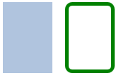

> **注意：**：颜色的命名是来自SVG颜色的名称（查看(http://www.w3.org/TR/css3-color/#svg-color)可以获取更多的颜色名称）。你也可以使用其它的方法来指定颜色，比如RGB字符串（'#FF4444'），或者一个颜色名字（例如'white'）。

#### **文本元素（Text Element）**

```QML
    Text {
        text: "Hello World! Click Me To Quit!"
    }
```
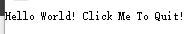

#### **图像元素（Image Element）**

```QML
    Image {
        anchors.centerIn: parent
        source: "猫.jpg"
    }
```
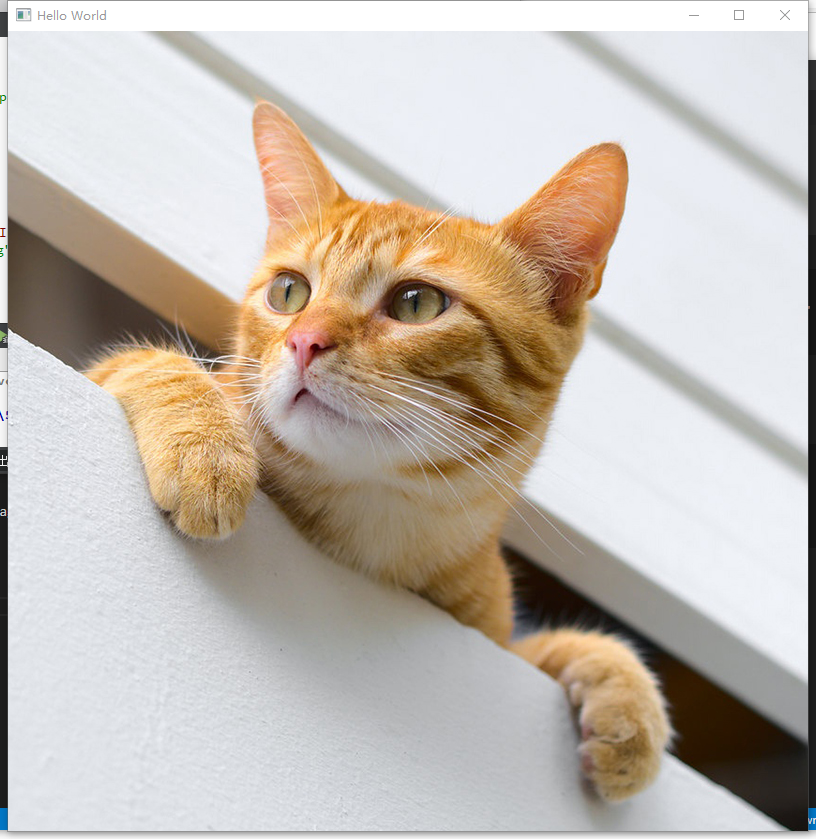

#### **鼠标区域元素（MouseArea Element）**

```QML
    Rectangle {
        id: rect1

        x: 12; y: 12

        width: 70; height: 100

        color: "lightsteelblue"
    }

    Rectangle {
        id: rect2

        x: 100; y: 12
        width: 70; height: 100

        border.color: "green"
        border.width: 5
        radius : 10

        MouseArea {
            id: mouse_area
            width: parent.width
            height: parent.width
            onClicked: rect1.visible = !rect1.visible
        }
    }
```
  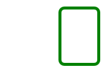

### 组件

一个组件是一个可以重复使用的元素，QML提供几种不同的方法来创建组件。但是目前我们只对其中一种方法进行讲解：一个文件就是一个基础组件。一个以文件为基础的组件在文件中创建了一个QML元素，并且将文件以元素类型来命名（例如后面给出的Button.qml）。

设计一个按钮，由一个矩阵内添加一个文本块和一个鼠标事件块组成。
```QML
//Button.qml
import QtQuick 2.0

Rectangle {
    id: root

    //导出属性
    property alias text: label.text
    signal clicked

    width: 116; height: 26
    color: "lightsteelblue"
    border.color: "slategrey"

    Text {
        id: label
        anchors.centerIn: parent
        text: "Start" //因为text被导出，所以可以不在这里初始化内容
    }

    MouseArea {
        anchors.fill: parent
        onClicked: {
            root.clicked()
        }
    }
}

```

如此组件就写好了，只要我们将包含组件的文件保存到项目目录中，就可以任意使用它了。

```QML
    Button {
        id: button
        x:50; y:50
        text: "开始"
        onClicked: {
            status.text = "开始就开始！"
        }
    }

    Text {
        id: status
        x:50; y:200
        width: 150; height: 50
        text: "等待中···"
        horizontalAlignment: Text.AlignHCenter
    }
```
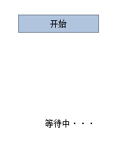  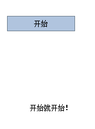

> **提示**：若想增加组件的密封性，可以让组件嵌套到Item对象里（记得导出属性），这样可以防止用户更改组件属性，以Button.qml为例：
```QML
//Button.qml
import QtQuick 2.0

Item {
    id: root

    property alias text: button.text
    signal clicked

    Rectangle {
        id: button

        //导出属性
        property alias text: label.text
        signal clicked

        width: 116; height: 26
        color: "lightsteelblue"
        border.color: "slategrey"

        Text {
            id: label
            anchors.centerIn: parent
        }

        MouseArea {
            anchors.fill: parent
            onClicked: {
                root.clicked()
            }
        }
    }
}
```

### 简单转换

转换操作改变了一个对象的几何状态。QML元素对象通常能够被平移，旋转，缩放。

简单的位移是通过改变`x`,`y`坐标来完成的。旋转是改变`rotation`（旋转）属性来完成的，这个值使用角度作为单位（0~360）。缩放是通过改变`scale`（比例）的属性来完成的，小于1意味着缩小，大于1意味着放大。旋转与缩放不会改变对象的几何形状，对象的`x`,`y`（坐标）与`width`/`height`（宽/高）也类似。只有绘制指令是被转换的对象。

利用之前所写过的按钮组件，实现点击按钮让图形进行相应的转换。
```QML
    Image {
        id: photo
        width: 300; height: 300
        source: "骷髅.png"
    }

    Button {
        id: button1
        x: 350; y: 0
        text: "按钮平移"
        onClicked: {
            photo.y += 100 //向下平移100个像素点
        }
    }

    Button {
        id: button2
        x: 450; y: 0
        text: "按钮旋转"
        onClicked: {
            photo.rotation += 90.0 //顺时针旋转90°
        }
    }

    Button {
        id: button3
        x:550; y: 0
        text: "按钮缩放"
        onClicked: {
            photo.scale += 0.5 //放大0.5倍
        }
    }
```
点击按钮前：  
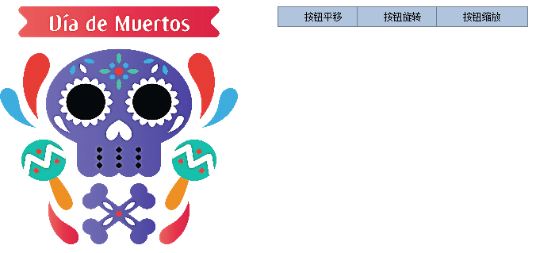
点击平移按钮：    
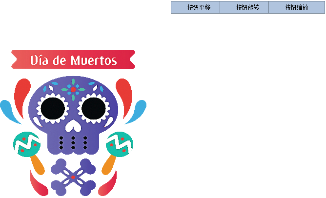  
点击旋转按钮：  
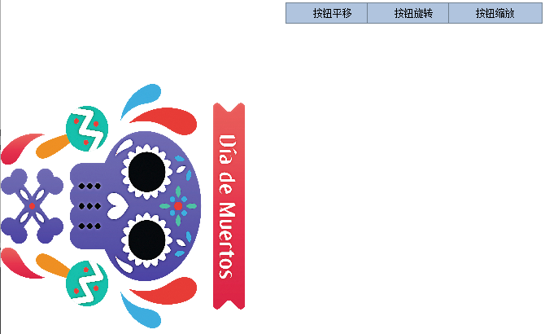  
点击缩放按钮：  
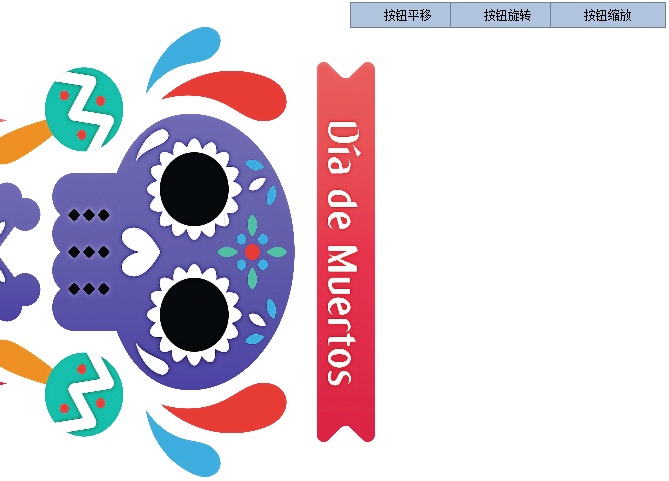

### 定位元素

有一些QML元素被用于放置元素对象，它们被称作定位器，QtQuick模块提供了Row（行），Column（列），Grid（组），Flow（流）用来作为定位器。

在展示例子前需要定义一些方块（这里只取其中一种，所有方块只有颜色是不同的）用于之后的展示：
```QML
Rectangle {
    width: 50
    height: 50

    color: "blue"
    border.color: Qt.lighter(color)
}
```
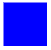

#### **Row（行）**

Row（行）元素将它的子对象通过顶部对齐的方式从左到右，或者从右到左依次排列。
```QML
    Row {
        id: row
        anchors.centerIn: parent
        layoutDirection: Qt.RightToLeft //排列方式，从右到左排列,默认从左到右
        spacing: 20 //元素间隔

        RectangleBlue { }
        RectangleGreen { }
        RectangleRed { }
    }
```


#### **Column（列）**

Column（列）元素将它的子对象通过顶部对齐的列方式进行排列。
```QML
    Column {
        id: row
        anchors.centerIn: parent
        spacing: 5 //元素间隔

        RectangleBlue { }
        RectangleGreen { }
        RectangleRed { }
    }
```
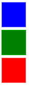